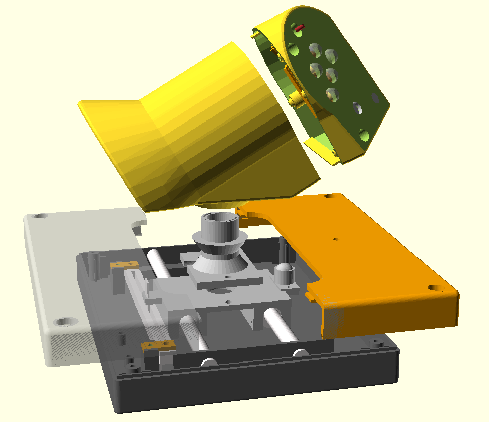
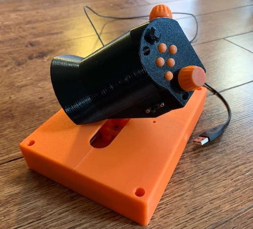
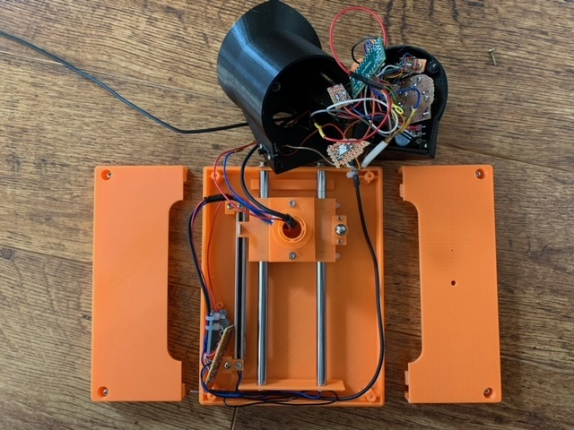
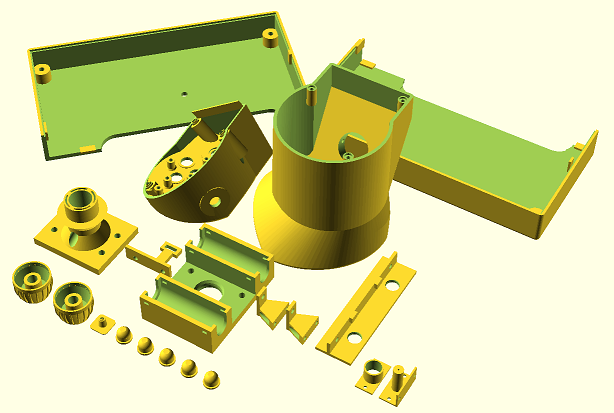
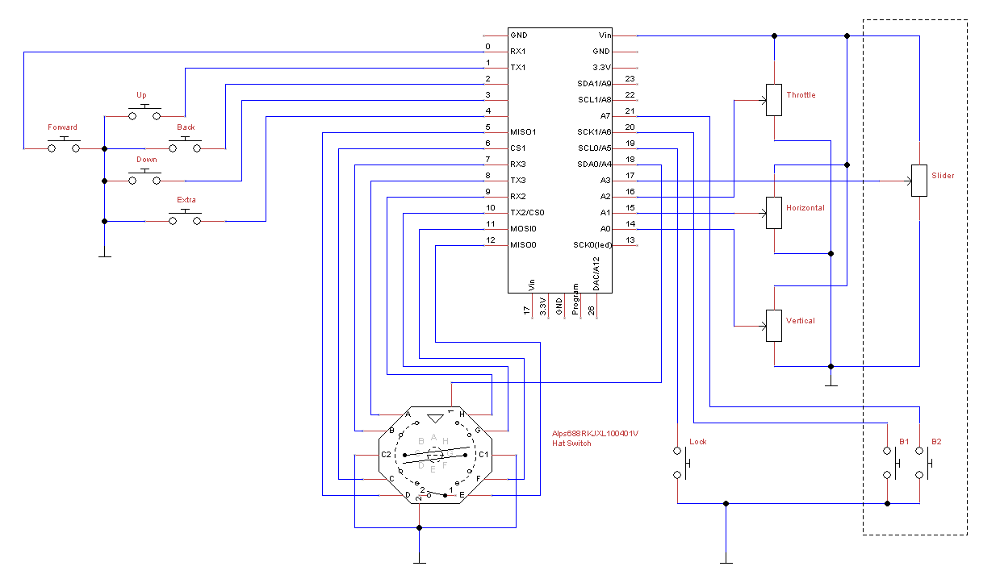
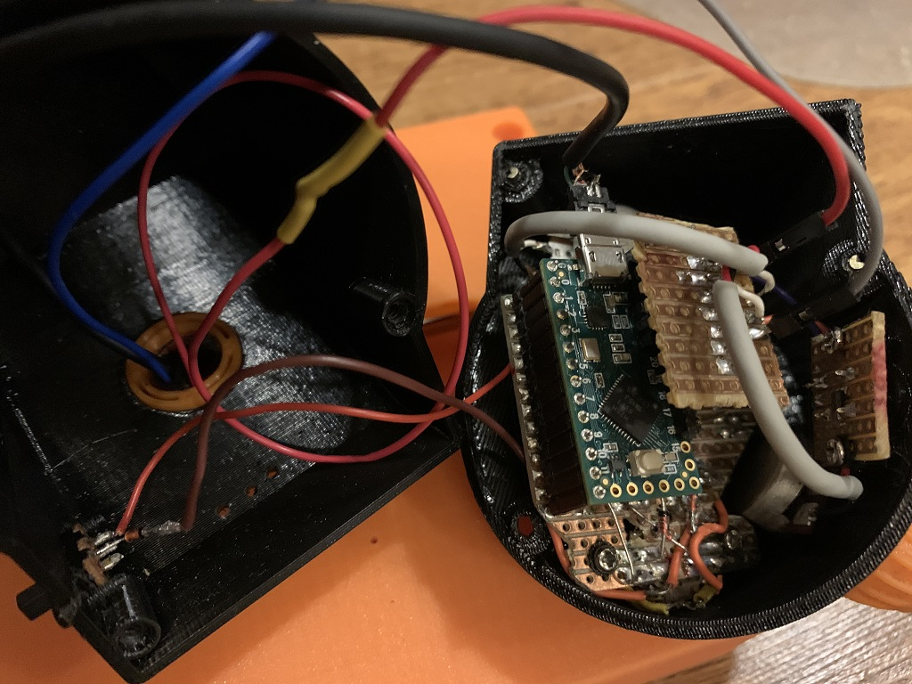
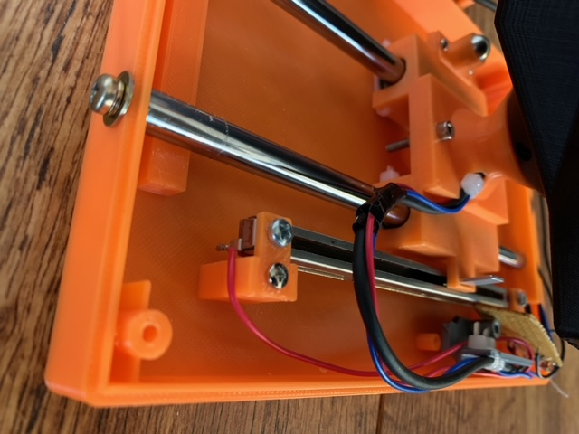
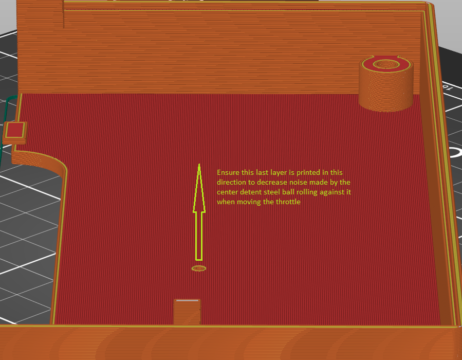

# Yet-Another HOTAS Throttle (YA-HOTAS-THROTTLE)

This 3D printable HOTAS throttle game controller. It connects as a standard USB joystick to Windows without needing to install any software.

It has:

 - 3 axis (throttle, vertical, horizontal) with center detents an all
 - 5 buttons
 - hat switch with 8 directions and press button
 - lock/program button
 - RGB LED indicating state: throttle center (green), locked (red), program (blue)
 - high quality mechanical and electro-mechanical components
 - adjustable throttle handle angle (twist) for better ergonomics at different table positioning
 - host additional USB serial connectivity for debugging and programming

**Complete Design Explosion View**

**A photo of an actual build (don't mind the colors - this is a fully working prototype build)**

**And when fully opened**

# Design

The design is based on these guidelines:

 - all buttons and knobs must be reachable without moving the palm on the hand
 - smooth and precise throttle operation
 - angled design for better ergonomics to miminize stress of the wrist and arm
 - parameterized design for tweaking ergonomics and control placement
 - allow some key build-time mechanical tuning options in case printing precision is not perfect
 - modularity for better flexibility and extensibility

The design is mostly parametrisized so that you can customize it to fit e.g. a bit larger hands better or different angles. This one is optimized for my smaller hands (e.g. Saitek X45 throttle was too big for my hands) so that I can reach all knobs and switches without moving my palm.

The microcontroller was placed in the handle section to minimize the amount of wires needed to be moved as the throttle is used. This and the cable management was design to allow completely smooth operation of the throttle so that the cables won't hinder or move the throttle at any position.

# Build

All 3D printable parts are designed using OpenSCAD and I printed them using my Prusa MK3S running the default .40mm nozzle. Most parts can be printed with 0.30mm layer height but some require 0.20mm layers to get proper results.

Some parts require or benefit from post-print processing:

 - drill the five button holes with e.g. 8.5mm drill to make the hole walls smooth and the buttons will work smoother
 - some screw holes may benefit from drilling for easier fit
 - throttle center detent hole could be drilled bigger for stronger detent or cone shaped with a bit larger drill head for smoother detent exit/entry

Below is an illustration of all printable parts.

Connect the wires like this to match the code:

*Note: The components within the dashed region in the right of the circuit diagram are not currently in the physical build. They only exist in the code and are for future extensions.*

Below are some photos of the assembly

The cable management is important to make the throttle handle move smoothly and not move on its own at any position due wires pushing it.

## Firmware

Directory **firmware** contains the code for Arduino. I has been tested with Arduino 1.8.9 on Teensy LC with USB Type **Serial + Keyboard + Mouse + Joystick**. You also need to have/install **Bounce2** and **FastLED** libraries. Prebuilt hex-file for Teensy LC is also located in the directory.

## Other Build Notes

Lighly lube the two metal rails, just like you would do for your 3D printer rails.

Ligtly lube the ball spring plunger with silicone based (or other plastic friently lube) for smoother throttle movement and less noise.

The right side of the case top that has the center detent - to get smoother and less noisy throttle movement:

 - apply little silicone lube spray to where the ball spring plunger meets the plastic
 - 3D print it so that the last layer is printed in the same direction as the ball moves! E.g. in Prusa slicer, I rotated this part 45 degrees before printing - see the pic below

The X/Y potentiometers' metal shafts I got required good lubing (e.g. CRC Elektro or teflon spray). They were quite stiff to turn, but lubing them made a big difference. I didn't have this sort of issue with other pots I had, but since I wanted ones with a center detent built-in, had to go with these.

This build does not use a keyboard diode matrix as Teensy LC has enough pins for all the current design's pots and switches. And still has some extra room available. For other Arduino boards with less pins, you would need to make a keyboard diode matrix and change the software to get the button states e.g. via **Keypad** Arduino library.

# Parts List

On top of the 3D printable components, you need

 - 2 x linear motion rods 8mm x 168mm (get one longer and cut in two)
 - 2 x linear bearings 8x15x45 (e.g. LM8LUU)
 - 1 x Teensy LC (or another Arduino board with enough pins)
 - 2 x 10kohm LIN pot (Bourns BI P160 with center detent e.g. KNOC-model)
 - 1 x 100mm travel 10kohm LIN slide pot (BI Technologies/TT Electronics PS100 B 10K 0E)
 - 1 x multidirectional switch 8 dir + press (Alps 688RKJXL 100401V)
 - 5 x switches (a tact switch with pins fitting the circuit board listed)
 - 1 x slide switch (any generic model you can fit the case)
 - some generic circuit board (0.1" / 2.54mm pin pitch)
 - N x screws (2.5mm and 3mm) for plastic - for case cover, handle thumb section and internal parts
 - 2 x screws 3mm for attaching the rods from one of their ends to the case
 - 2 x screws 2mm for attaching the slide potentiometer
 - 6 x zip ties for attaching the bearings and do cable management, small ones will do
 - wires
 - 1 x RGB LED (WS2812 compatible)
 - 1 x 9.5mm steel ball
 - 1 x steel spring of e.g. 4.5x22mm (one from a regular ball point pen will work well)

The Teensy LC can quite easily be replaced with any Arduino compatible device with USB connectivity and enough pins. With more coding effort any USB capable micro controller that fits the case could also do.

The RGB LED and slide switch (lock/program) are fully optional. The multi-directional hat switch can also easily be left out, replaced with a simple switch or with a similar hat switch.

The steel ball and spring are used to make the center detent for the throttle. Different size ball and spring can be used by modifying the printed *BallSpringPlunger* parameters in the OpenSCAD files.

## Lock/Program

I had two options of the Lock-button. One is a slider switch (currently implemented) and another is to use a simple button switch. Either way, once Lock-mode is on, the throttle axis value is locked to its current value. This is to prevent in-game accidents while you're e.g. AFK and your cat jumps on the throttle.

For simple buttons, the following logic could be made. Press and hold Lock-button for a while and all axis will lock onto their current position. Unlock by pressing Lock button once. Double-click Lock-button to switch between secondary mode that redefines all buttons, hat and axis.

# Discussions and Considerations

## Pots vs Hall effect vs rotation encodes

I did consider using hall sensors or even rotational encoders with belt/pulley system, but eventually found them overly complex to assemble over using simple linear slide potentiometer. We're building these by ourselves and making it all too complex only makes less people (including me) actually build it successfully in quality.

The ones I used here (TT Electronics' PS100) are very smooth, accurate enough and are rated for 100000 cycles while costing only 4-5 euros a piece. So, if they still wear out at some point, just replace it with a new one. It's *your* own build anyway and not something you sell in millions while staying clear of warranty claims.

Many rotary systems might also require manual calibration every time the machine is restarted as the absolute position is not necessarily known. I've seen some hall sensor joysticks requiring that and I found it an undesired feature.

I also considered using some form of lever system (like is done e.g. in Thrustmaster's throttle unit) and transfer the linear motion into a rotational potentiometer. But they easily come with some mechanical "play". Also, some inherent non-linearity of such construct would have to be compensated in the code.

## Throttle Handle Twist or Not

The current design allows either fixing the handle in place with a screw or leave the screw out and allow rotating the handle to a location that suits your current sitting position. The fitting of the throttle shaft to the handle is quite stiff on purpose.

It would be relatively easy to add an actual axis to the twist of the handle. Some throttles have a rocker on the front for this. However, I didn't add that here as rudder pedals or joystick with a twisting handle works better. This throttle is *very* smooth and light to operate so asserting any other forces with the same hand would likely interfere with the throttle.
