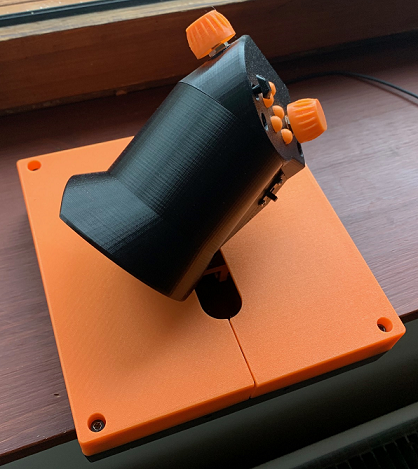

# My HOTAS Throttle

This is mostly 3D printable HOTAS throttle for USB.

**The photo (don't mind the colors - this is first fully working build)**

# Features

This HOTAS throttle has:

 - 3 axis (throttle, vertical, horizontal) with center detents an all
 - 5 buttons
 - hat switch with 8 directions and press button
 - lock/program button
 - RGB LED indicating state: throttle center (green), locked (red), program (blue)
 - Connect as USB joystick to Windows without needing to install any software
 - USB serial connectivity for debugging and programming
 - high quality mechanical and electro-mechanical components
 - adjustable throttle handle angle (twist) for better ergonomics at different table positioning

# Design

The design is based on these guidelines:

 - all buttons and knobs must be reachable without moving the palm of the hand
 - smooth and precise throttle operation
 - angled design for better ergonomics to miminize stress of the wrist and arm
 - parameterized design for tweaking ergonomics and control placement
 - allow some key build-time mechanical tuning options in case printing precision is not perfect

The design is mostly parametrisized so that you can customize it to fit e.g. a bit larger hands better or different angles. This one is optimized for my smaller hands (e.g. Saitek X45 throttle was too big for my hands) so that I can reach all knobs and switches without moving my palm.

The microcontroller was placed in the handle section to minimize the amount of wires needed to be moved as the throttle is used. This and the cable management was design to allow completely smooth operation of the throttle so that the cables won't hinder or move the throttle at any position.

# Build

All 3D printable parts are designed using OpenSCAD and I printed them using my Prusa MK3S running the default .40mm nozzle. Most parts can be printed with 0.30mm layer height but some require 0.20mm layers to get proper results.

Some parts require or benefit from post-print processing:

 - drill the five button holes with e.g. 8.5mm drill to make the hole smooth and buttons work smoother
 - some screw holes may benefit from drilling for easier fit
 - throttle center detent hole could be drilled bigger for stronger detent or cone shaped with a lerger drill head for smoother detent exit/entry

Connect the wires like this to match the code:

## Firmware

Directory **firmware** contains the code for Arduino. I has been tested with Arduino 1.8.9 on Teensy LC with USB Type **Serial + Keyboard + Mouse + Joystick**. You also need to have/install Bounce2 and FastLED libraries. There is also prebuilt hex-file for Teensy LC there.

## Other Build Notes

Lighly lube the two metal rails, just like you do your 3D printer rails.

Ligtly lube the ball spring plunger with silicone based (or other plastic friently lube) for smoother throttle movement and less noise.

The right side of the case top that has the center detent - to get smoother and less noisy throttle movement:

 - 3D print it so that the last layer is printed in the same direction as the ball moves! E.g. in Prusa slicer, I rotated this part 45 degrees before printing
 - apply little silicone lube spray to where the ball spring plunger meets the plastic
 
The X/Y potentiometers' metal shafts I got required good lubing (e.g. CRC Elektro or teflon spray). They were quite stiff to turn, but lubing them made a big difference. I didn't have this sort of issue with other pots I had, but since I wanted ones with a center detent built-in, had to go with these.

# Parts List

On top of the 3D printable components:

 - 1 x Teensy LC
 - 2 x 10kohm LIN pot (Bourns BI P160 with center detent e.g. KNOC-model)
 - 1 x 100mm travel 10kohm lin slide pot (Bourns PS100 B 10K 0E)
 - 1 x multidirectional switch 8 dir + press (Alps 688RKJXL 100401V)
 - 5 x switches (a tact switch with pins fitting the circuit board listed)
 - 1 x slide switch (any generic model you can fit the case)
 - 2 x linear bearings 8x15x45 (LM8LUU)
 - 1 x linear motion rod 8mm (cut in two 168mm pieces)
 - 1 x joystick case (Saitek X45 stick part - or print it yourself)
 - 1 x RGB LED (WS2812 compatible)
 - some generic circuit board (0.1" / 2.54mm pin pitch)
 - wires
 - screws (2.5mm and 3mm)

The Teensy LC can quite easily be replaced with any Arduino compatible device with USB connectivity and enough pins. With more coding effort any USB capable micro controller that fits the case could also do.

The RGB LED and slide switch (lock/program) are fully optional. The multi-directional hat switch can also easily be left out, replaced with a simple switch or with a similar hat switch.

## Lock/Program

I had two options of the Lock-button. One is a slider switch (currently implemented) and another is to use a simple button switch. Either way, once Lock-mode is on, the throttle axis value is locked to its current value. This is to prevent in-game accidents while you're e.g. AFK and your cat jumps on the throttle.

For simple buttons, the following logic could be made. Press and hold Lock-button for a while and all axis will lock onto their current position. Unlock by pressing Lock button once. Double-click Lock-button to switch between secondary mode that redefines all buttons, hat and axis.

## TO-DO

**Fix:**

 - Make printable bottom case (now reusing Saitek X45 throttle case)
 - Make case and rod supports to both ends with exact correct rod separation
 - Add Lock-switch place to handle print
 - Cable insert cut into the handle shaft
 - Cleanup 3D code

**New features:**

 - Easily interchangeable detent disks! Some games can use more or less detents at diffent positions (e.g. no detents at all, 50% for Elite, at 75% for jet plane afterburner, 30% for propeller plane approach and 60% for transition flight, etc.)
 - Emboss button and other control names to thumb plate or make way to attach printable labels/sheet
 - Add two buttons to front and lower thumb
 - Add a place for the lights so they can be seen
 - Turn LEDs off when computer is sleeping
 - Curvier case cover near to player for better ergonomics when the throttle is placed nearer to the table edge (in certain positions mid-arm may rub against the case cover)
